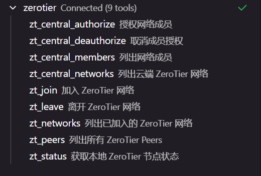

# ZeroTier Go SDK

ZeroTier API 的 Go SDK。

## 安装

```bash
go get github.com/fromsko/zerotier-sdk
```

## 模块

| 模块        | 用途              | 地址                    |
| ----------- | ----------------- | ----------------------- |
| `client`    | 本地节点管理      | localhost:9993          |
| `central`   | 云端 Central v1   | api.zerotier.com        |
| `central/v2`| 云端 Central v2   | central.zerotier.com    |

## 快速开始

```go
import zerotier "github.com/fromsko/zerotier-sdk"

// 本地节点
local := zerotier.NewClient()
status, _ := local.Status()
networks, _ := local.Networks().List()

// 云端管理（Central v1）
cloud := zerotier.NewCentral("your_api_token")
networks, _ := cloud.Networks().List()
cloud.Networks().Members("nwid").Authorize("member_id")

// 云端管理（Central v2）
cloudV2, _ := zerotier.NewCentralV2("your_service_account_token")
// central/v2 客户端用法参见 central/v2 包
```

## Client（本地 API）

```go
c := zerotier.NewClient()

// 节点状态
status, _ := c.Status()

// 网络
c.Networks().List()
c.Networks().Join("network_id")
c.Networks().Leave("network_id")

// Peers
c.Peers().List()

// 控制器（自托管）
c.Controller().CreateNetwork(nodeID, config)
```

详见 [client/README.md](client/README.md)

## Central（云端 API）

```go
c := zerotier.NewCentral("token")

// 网络
c.Networks().List()
c.Networks().Create(config)
c.Networks().Delete("network_id")

// 成员
c.Networks().Members("nwid").List()
c.Networks().Members("nwid").Authorize("member_id")
```

## Central V2

```go
c, _ := zerotier.NewCentralV2("service_account_token")
// 或直接使用 central/v2 包
import centralv2 "github.com/fromsko/zerotier-sdk/central/v2"

client, _ := centralv2.NewClientWithToken("service_account_token")
```

详见 [central/README.md](central/README.md)

## Builder 模式

```go
// 本地网络设置
zerotier.NewNetworkSettings().
    AllowDNS(true).
    AllowManaged(true).
    Build()

// 云端网络配置
zerotier.NewCentralNetworkConfig().
    Name("My Network").
    Private(true).
    AddRoute("10.0.0.0/24", nil).
    AddIPPool("10.0.0.1", "10.0.0.254").
    V4AssignMode(true).
    Build()

// 云端成员配置
zerotier.NewCentralMemberConfig().
    Name("my-device").
    Authorized(true).
    Build()
```

## 项目结构

```
zerotier-sdk/
├── zerotier.go      # 统一接口
├── client/          # 本地 Service API
├── central/         # 云端 Central v1 API
├── central/v2/      # 云端 Central v2 API
├── mcp/             # MCP 服务集成
├── cmd/mcp/         # MCP 服务入口
└── example/         # 使用示例
```

## MCP 集成

支持与 Claude、Cursor、Cherry Studio 等 AI 工具集成：
- 本地节点状态/网络/Peers
- Central v1 网络、成员、组织、邀请、用户、Token
- Central v2 组织/网络组/网络/成员
- 批量授权/取消授权/删除/重命名/设置 IP
- 成员排行榜（按名称/在线/IP/创建时间/上线时间排序）

详见 [mcp/README.md](mcp/README.md)

```go
package main

import (
	"log"
	"os"

	"github.com/fromsko/zerotier-sdk"
	ztmcp "github.com/fromsko/zerotier-sdk/mcp"
)

func main() {
	var opts []ztmcp.Option

	if localToken := os.Getenv("ZT_LOCAL_TOKEN"); localToken != "" {
		localClient := zerotier.NewClient(
			zerotier.WithClientBaseURL("http://localhost:9993"),
			zerotier.WithClientToken(localToken),
		)
		opts = append(opts, ztmcp.WithLocalClient(localClient))
	}

	if token := os.Getenv("ZT_CENTRAL_TOKEN"); token != "" {
		opts = append(opts, ztmcp.WithCentralToken(token))
	}

	if v2Token := os.Getenv("ZT_CENTRAL_V2_TOKEN"); v2Token != "" {
		opts = append(opts, ztmcp.WithCentralV2Token(v2Token))
	}

	// 创建 MCP 服务
	s := ztmcp.New("zerotier", "1.1.0", opts...)

	// 启动 stdio 服务
	if err := s.ServeStdio(); err != nil {
		log.Fatalf("Server error: %v", err)
	}
}
```



## License

MIT
